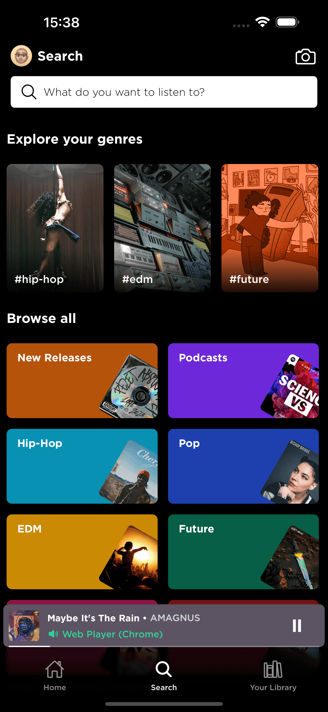
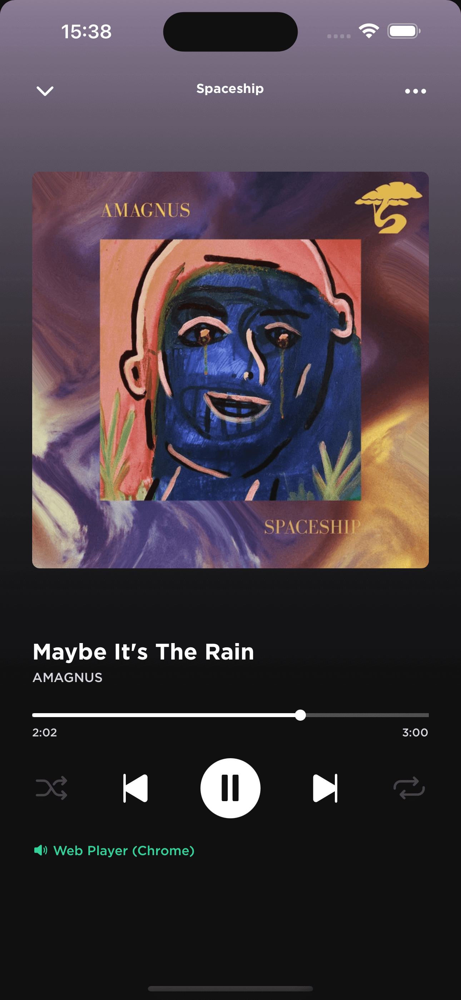
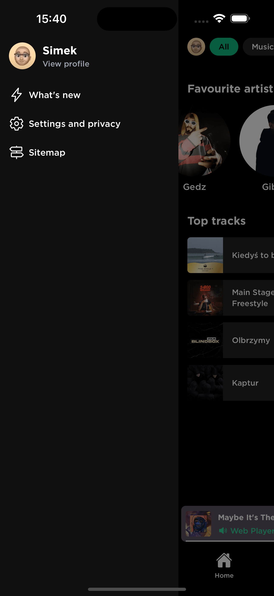

# `router-spotify`

A stub app created to dogfood `expo-router`, `nativewind` and other Expo SDK packages.

> [!important]
> Using some features, like playback control, require Spotify Premium subscription.

## App preview

## Development builds

You can download the latest development build using links below:
* [Android](https://expo.dev/accounts/simek/projects/router-spotify/builds/c03aa0b7-5e74-4d61-9eb2-53c37ceeb0dc)
* [iOS](https://expo.dev/accounts/simek/projects/router-spotify/builds/959bdfea-7fbb-4c06-aa7f-12072905d06a) (simulator only)

## Contributing

1. Create new Spotify App at https://developer.spotify.com/dashboard/create.
   * Set Redirect URI to: `routerspotify://`.
2. Enter the app Client ID and Secret in `.env.example`, then rename file to `.env.local`.
